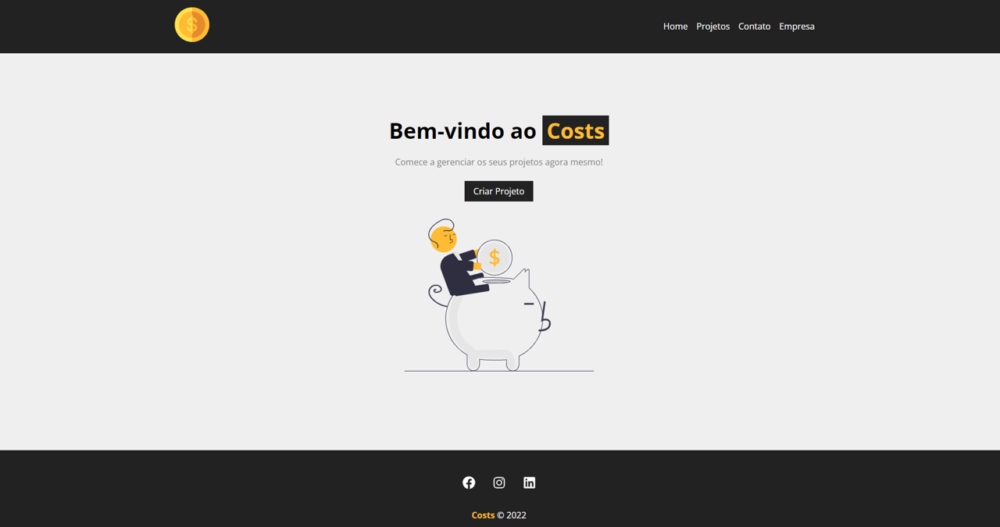
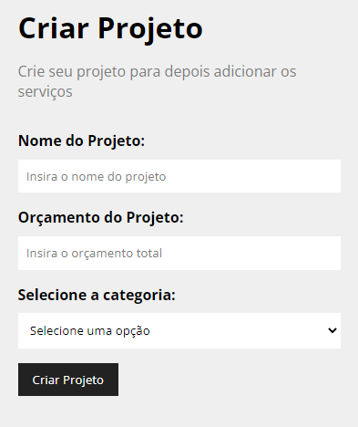
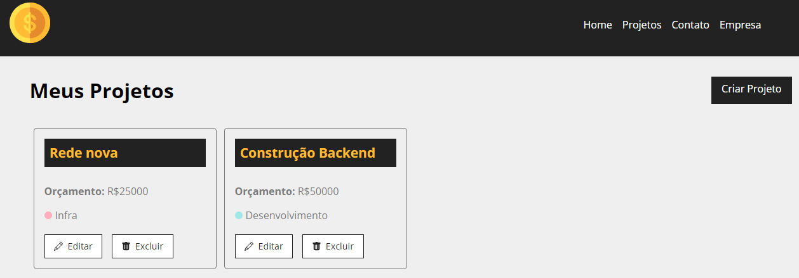
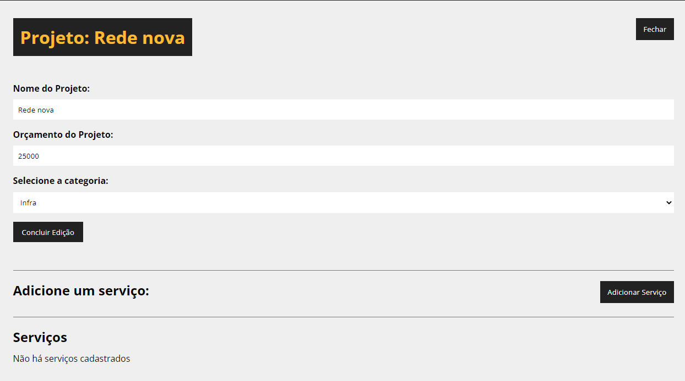
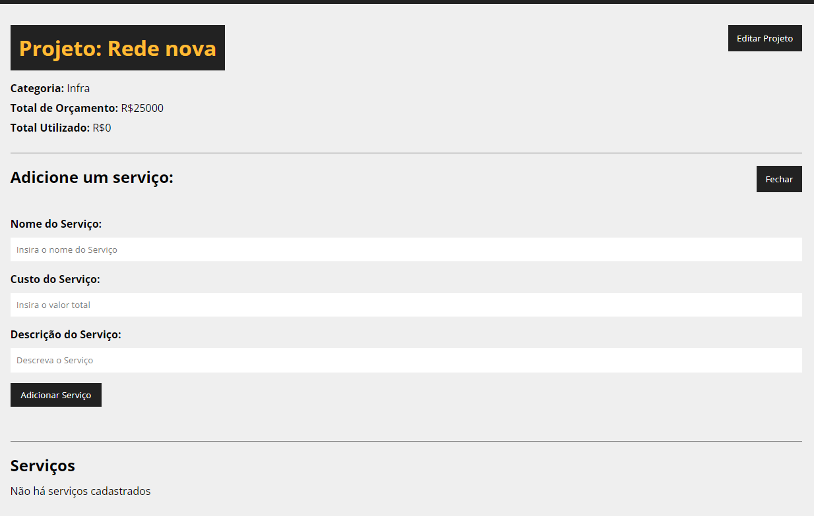
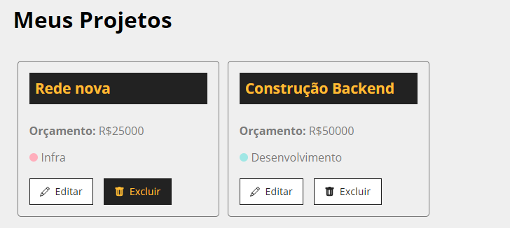
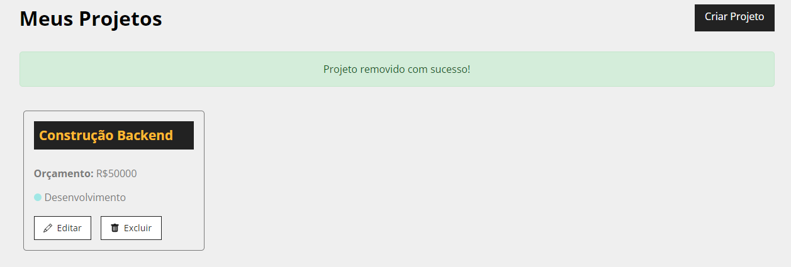

<p align="center">
  
</p>

<h1 style="text-align: center;">Projeto Costs</h1>


## 💻 Projeto

Aprender e aplicar os conhecimentos ensinados através do curso: [Curso de React](https://www.youtube.com/watch?v=FXqX7oof0I4&list=PLnDvRpP8BneyVA0SZ2okm-QBojomniQVO) ministrado por Matheus Battisti - Hora de Codar, através do youtube, gratuitamente

Esse projeto serve de prática para a montagem de um site para o acompanhamento de projetos, sendo possível criar, consultar, modificar e apagar projetos ~~(famoso CRUD)~~.

----

### 📊Funcionalidades
- [x] **Criação de Projetos**: Necessário colocar o Nome do Projeto, Orçamento do Projeto e Selecionar uma dentre as 4 categorias
<p align="center">
  
</p>


- [x] **Consulta de Projetos**: Possível visualização dos projetos em caixas, contendo: **Nome do Projeto, Orçamento do Projeto, Categoria**
<p align="center">
  
</p>


- [x] **Modificação de Projetos**: Além de editar o Nome, Valor e Categoria do projeto, é possível adicionar serviços a fim de comprometer o orçamento do projeto.

Edição de Projetos         |  Adição e Edição de serviços 
:-------------------------:|:-------------------------:
  |  

- [x] **Apagar Projetos**: A fim de apagar um projeto por completo da lista de projetos.

Click no botão de Apagar   |  Remoção concluída com sucesso 
:-------------------------:|:-------------------------:
  |  
---

## :rocket: Tecnologias

-  [React](https://pt-br.reactjs.org/)
-  [React-Icons](https://react-icons.netlify.com/)
-  [React Router](https://reactrouter.com/en/main)
-  [uuid](https://www.uuidgenerator.net/)

## 📥 Instalação e execução

Faça um clone desse repositório e acesse o diretório.

```bash
$ git clone git@github.com:Hiemer23/Projeto_Costs.git
```

```bash
# Instalando as dependências
$ npm install

# Executanto aplicação Fronted
$ npm start

```
```bash
# Executanto aplicação Backend
$ npm run backend

```
